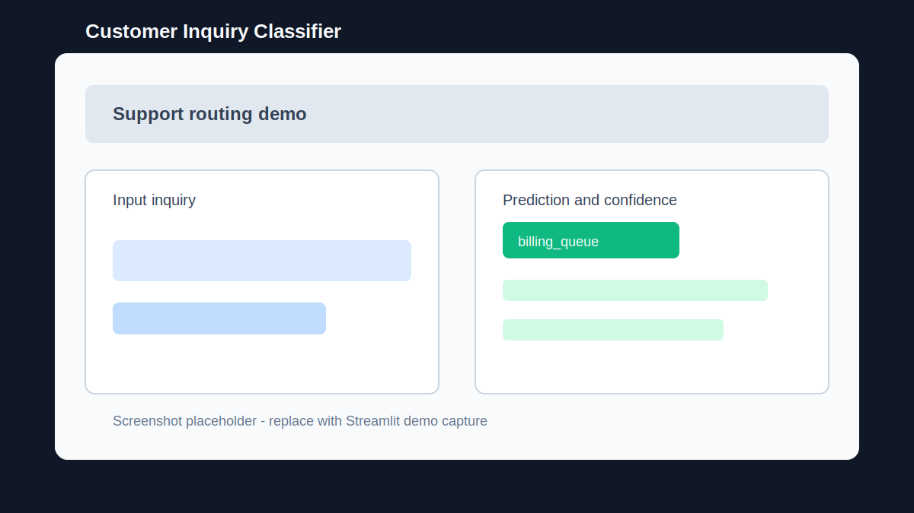
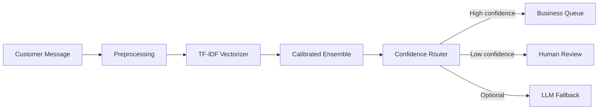

# Customer Inquiry Classifier

Production-style NLP routing system that classifies customer support messages, estimates confidence, and sends uncertain cases to human review.

## Live Demo

- Streamlit demo: https://customer-inquiry-classifier-1.streamlit.app/
- API demo: Demo coming soon
- Local API docs: `http://localhost:8000/docs`

## Visual Proof



Replace this placeholder with a real Streamlit/API screenshot after the next demo capture.

## Problem

Support teams spend time manually routing repetitive customer messages across billing, shipping, refunds, technical support, and account queues. This project automates first-pass triage while keeping a human-review path for low-confidence or ambiguous messages.

## Features

- Synthetic customer-inquiry generator with noisy, short, long, and ambiguous examples.
- Text preprocessing with graceful offline fallback.
- TF-IDF features over word and phrase patterns.
- Soft-voting ensemble with calibrated confidence.
- Confidence-based routing: auto-route high-confidence messages, escalate low-confidence ones.
- Optional OpenAI fallback for low-confidence cases.
- FastAPI inference API and Streamlit demo UI.
- Tests, CI, Dockerfile, and Render blueprint.

## Architecture



## Tech Stack

| Layer | Tools |
| --- | --- |
| ML | scikit-learn, TF-IDF, LinearSVC, Logistic Regression |
| API | FastAPI, Pydantic, Uvicorn |
| UI | Streamlit, Plotly |
| Packaging | Joblib model artifact |
| Deployment | Docker, Render, Streamlit Cloud |
| Quality | Pytest, Ruff, GitHub Actions |

## Project Structure

```text
customer-inquiry-classifier/
├── app/
│   ├── api.py            # FastAPI app
│   └── classifier.py     # data generation, preprocessing, model, routing
├── models/               # trained model artifact
├── scripts/              # utility package
├── tests/                # classifier tests
├── streamlit_app.py      # demo UI
├── MODEL_CARD.md
├── DATASET_CARD.md
├── DEPLOYMENT.md
└── render.yaml
```

## Setup

```bash
python -m venv .venv
source .venv/bin/activate
pip install -r requirements.txt
cp .env.example .env
```

Run the API:

```bash
uvicorn app.api:app --reload
```

Run the UI:

```bash
streamlit run streamlit_app.py
```

## Environment Variables

| Variable | Purpose |
| --- | --- |
| `ROUTING_CONF_THRESHOLD` | Confidence threshold for auto-routing |
| `ENABLE_LLM_FALLBACK` | Enables optional LLM fallback for low-confidence cases |
| `COMPARE_WITH_LLM` | Compares ML result with optional LLM result |
| `OPENAI_API_KEY` | Required only when LLM fallback is enabled |
| `OPENAI_MODEL` | LLM fallback model name |
| `API_BASE_URL` | Streamlit UI API target |

## Usage and API

Health:

```bash
curl http://localhost:8000/health
```

Single prediction:

```bash
curl -X POST http://localhost:8000/predict \
  -H "Content-Type: application/json" \
  -d '{"text":"I was charged twice and need a refund."}'
```

Batch prediction:

```bash
curl -X POST http://localhost:8000/predict/batch \
  -H "Content-Type: application/json" \
  -d '{"texts":["My app keeps crashing","Where is my package?"]}'
```

## ML Approach

The model is a classical NLP pipeline:

1. Generate and normalize synthetic support-ticket text.
2. Extract TF-IDF features from unigrams, bigrams, and trigrams.
3. Train a soft-voting ensemble with calibrated probabilities.
4. Return the predicted category, confidence, routing decision, queue, and keyword explanations.
5. Escalate uncertain cases instead of pretending the model is always right.

## Evaluation

The repo includes tests for model training and inference behavior. For production evaluation, track:

- Macro F1 across categories.
- Per-class recall for urgent queues such as billing and refund/return.
- Confusion matrix across the seven support categories.
- Low-confidence escalation rate.
- API latency for `/predict` and `/predict/batch`.

See `MODEL_CARD.md` and `DATASET_CARD.md` for limitations and dataset notes.

## Deployment

- Streamlit UI: Streamlit Community Cloud.
- FastAPI API: Render or Railway using `render.yaml` or the Dockerfile.
- Vercel is not recommended for the FastAPI backend.

See `DEPLOYMENT.md` for deployment steps.

## Roadmap

- Add a saved evaluation report generated during training.
- Add confusion matrix image after each model refresh.
- Replace synthetic-only data with anonymized real support tickets if available.
- Add monitoring for drift in incoming message patterns.

## Author

Yash Sharma - MCA AI/ML student focused on NLP, ML systems, GenAI, and backend AI services.
