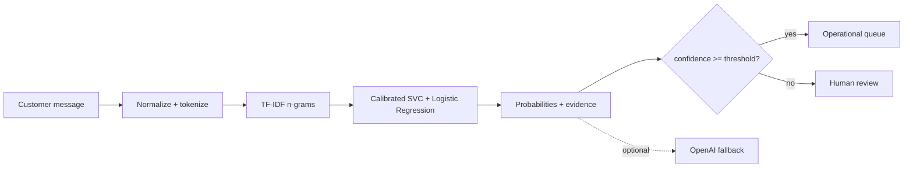

# Customer Inquiry Classifier

[](https://github.com/Yashsh101/customer-inquiry-classifier/actions/workflows/ci.yml)
[](LICENSE)

A FastAPI service for first-pass customer-support routing. It predicts one of seven inquiry categories, returns calibrated probabilities and keyword-style evidence, and sends low-confidence cases to a human-review queue.

## Problem

Support teams need a transparent first routing decision, not an opaque auto-resolution system. This project combines TF-IDF features, a calibrated LinearSVC/logistic-regression soft-voting ensemble, confidence thresholds, queue mapping, and an optional LLM fallback.

## Demo

**Live URL:** [customer-inquiry-classifier.vercel.app](https://customer-inquiry-classifier.vercel.app/)

The demo homepage currently responds successfully. The API health route is pending verification; verify the live UI and model status before using the URL as a portfolio demo. No production SLA or real-customer accuracy claim is made.

## Architecture


```mermaid
flowchart LR
  A[Customer message] --> B[Normalize + tokenize]
  B --> C[TF-IDF n-grams]
  C --> D[Calibrated SVC + Logistic Regression]
  D --> E[Probabilities + evidence]
  E --> F{confidence >= threshold?}
  F -->|yes| G[Operational queue]
  F -->|no| H[Human review]
  E -. optional .-> I[OpenAI fallback]
```

### Key decisions

- **Classical baseline first:** the checked-in model is fast, inspectable, and does not require an LLM for normal predictions.
- **Calibration and routing:** confidence controls whether a message is auto-routed or escalated.
- **Human review by default for uncertainty:** this is a routing aid, not an autonomous support decision-maker.
- **Optional fallback:** OpenAI is only used when enabled and configured; failures fall back to the classical result or human review.

See [`MODEL_CARD.md`](MODEL_CARD.md) and [`DATASET_CARD.md`](DATASET_CARD.md).

## Quickstart

### 1. Clone and install

```bash
git clone https://github.com/Yashsh101/customer-inquiry-classifier.git
cd customer-inquiry-classifier
python3 -m venv .venv
. .venv/bin/activate          # Windows: .venv\\Scripts\\Activate.ps1
python -m pip install --upgrade pip
python -m pip install -r requirements-dev.txt
```

### 2. Configure

```bash
cp .env.example .env
```

The default configuration disables the optional LLM fallback. No secret is required for normal local inference. Keep `OPENAI_API_KEY` empty unless fallback or comparison is explicitly enabled.

### 3. Run

```bash
uvicorn app.api:app --reload
```

Open `http://localhost:8000/docs`. For the Vercel-style local shell, use `npx vercel dev` after installing the Vercel CLI.

## API

```bash
curl -X POST http://localhost:8000/api/predict \
  -H 'Content-Type: application/json' \
  -d '{"text":"I was charged twice this month and need a refund"}'
```

| Endpoint | Purpose |
|---|---|
| `GET /api/health` | Model and service health |
| `GET /api/categories` | Supported labels and queues |
| `POST /api/predict` | Single-message prediction |
| `POST /api/predict/batch` | Batch prediction |

## Evaluation

- **Dataset:** Synthetic messages generated by `DataGenerator` across seven categories. See [`DATASET_CARD.md`](DATASET_CARD.md).
- **Metrics:** Track accuracy, macro F1, per-class precision/recall, confusion matrix, human-review rate, and inference latency. A real held-out or anonymized validation set is not committed.
- **Baseline:** TF-IDF plus calibrated SVC/logistic-regression ensemble; no real-world baseline is claimed.
- **Reproduction:** The current automated gate is `pytest tests/ -q`. A reproducible model-quality report from a separate held-out dataset is **pending verification**.
- **Interpretation:** Synthetic-data performance must not be presented as production performance on real users.

## Failure cases, security, and limitations

- Empty or malformed requests are rejected by API validation.
- Low-confidence or ambiguous messages are routed to `human_review_queue`.
- If the optional OpenAI fallback is unavailable, the service logs the failure and keeps the classical path; it does not require fallback for normal inference.
- Synthetic templates underrepresent multilingual, code-mixed, slang, sarcasm, and multi-intent customer messages.
- Do not auto-close tickets or take sensitive account actions from this model alone.
- Do not commit `.env`, API keys, customer messages, or model artifacts generated from private data.

## Verification

```bash
ruff check app api tests --ignore E501
python -m compileall app api tests
pytest tests/ -q
python -m pip check
```

CI runs the same dependency install, lint, compile, and test gates. Current local tests and the live health check passed during the audit; exact external deployment freshness remains environment-dependent.

## Deployment status

Vercel configuration is checked in (`vercel.json`, `api/index.py`, and `public/`). The demo homepage was reachable during audit; the API health endpoint returned a non-200 response and is **pending verification**. Deployment configuration is present, but capacity, monitoring, real-data quality, and SLA claims are **pending verification**.

## Roadmap

1. Add an anonymized realistic validation set and calibration report.
2. Add confusion-matrix and per-class metrics to CI artifacts.
3. Add API contract tests for batch, fallback, and malformed input cases.
4. Add observability for review rate, drift, and model version.

## License

MIT — see [`LICENSE`](LICENSE).
